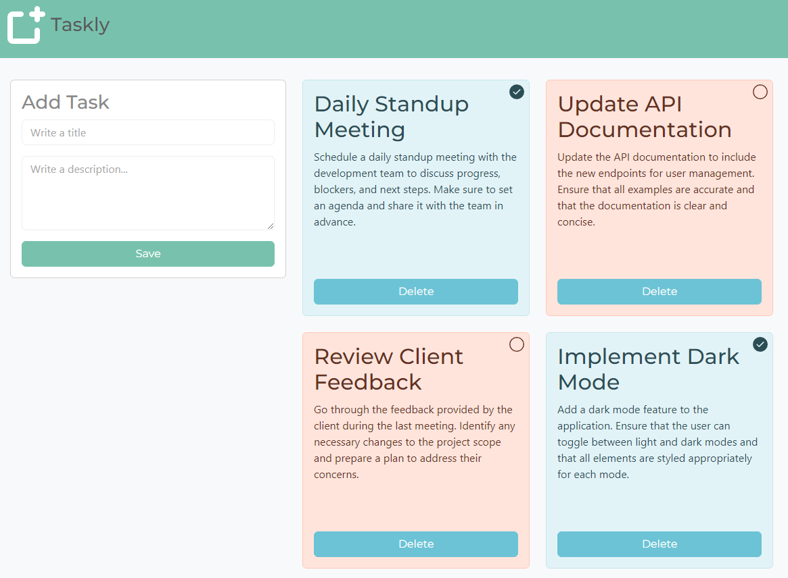

 
  <h1>Taskly with React + TS + Booststrap</h1>

 
  
  
   
  
  
  
  
  
  
  

## Description

**Taskly** is a project developed to start my journey with TypeScript and Bootstrap. It is a task management application where you can add, delete, and mark tasks as completed. 

Throughout this project, I have learned:
- How to integrate TypeScript with React for type safety.
- How to use Bootstrap for responsive and modern UI design.
- How to manage state in a React application and handle user interactions.

The primary goal of this project was to gain hands-on experience with TypeScript and Bootstrap by building a functional task management application.

## Key Features

- **Add Tasks**: Create new tasks with a title and description.
- **Delete Tasks**: Remove tasks from the list.
- **Toggle Completion**: Mark tasks as completed or pending.

## Screenshots

  

## Additional Information

- Developed by Evelin Alvarado.
- Find me on [GitHub](https://github.com/EvelinAlvarado) and [LinkedIn](https://www.linkedin.com/in/evelinalvarado/).

Check out the live project: [Taskly App](https://taskly-zeta.vercel.app/)
